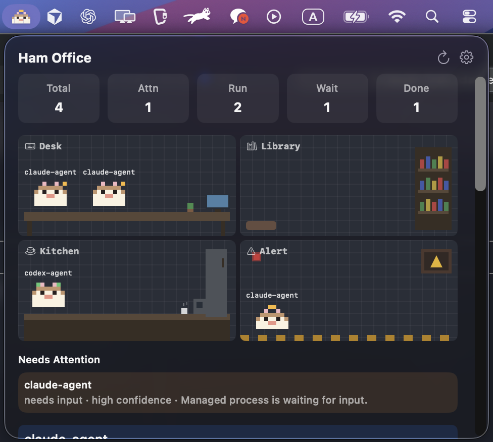
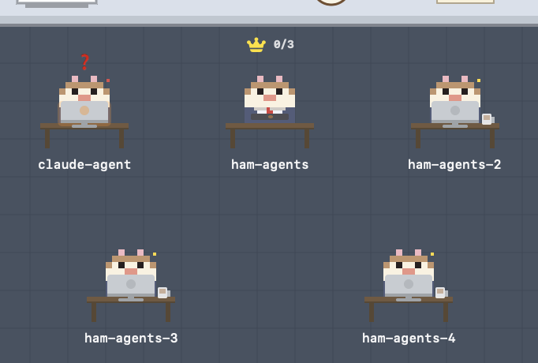

<p align="center">
  
</p>

<h1 align="center">ham-agents</h1>

<p align="center">
  <strong>Your AI agents, visualized as a hamster team.</strong>
  <br>
  A macOS menu bar app that turns Claude Code sessions into a pixel office.
  <br><br>
  <a href="#install">Install</a> &middot;
  <a href="#how-it-works">How it works</a> &middot;
  <a href="#cli">CLI</a> &middot;
  <a href="#features">Features</a> &middot;
  <a href="#development">Development</a>
</p>

---

## Install

```bash
brew tap 0doyun/ham
brew install ham
ham setup
```

Done. Now open a terminal and run `claude` — a pixel hamster office appears in your menu bar.

No extra commands needed. Every Claude Code session automatically becomes a hamster at a desk.

> **Requirements:** macOS 13+ (Apple Silicon) · [Claude Code](https://docs.anthropic.com/en/docs/claude-code)

## Update

```bash
brew upgrade ham
ham setup              # re-register hooks for the new version
```

## Uninstall

```bash
ham uninstall          # remove hooks, stop daemon, unload launchd
brew uninstall ham     # remove binaries
```

## How it works

ham-agents is **fully hook-based**. It plugs into Claude Code's hook system so everything is tracked without changing how you work.

1. **`ham setup`** detects your Claude Code version and registers up to 27 hook types — this is the only setup you need
2. **You run `claude` as usual** — the session-start hook automatically launches the menu bar and registers your session as a hamster
3. **Every tool use, notification, and error** is tracked in real time via hooks and reflected in the pixel office

> **Upgrading from v0.1.x?** Run `ham setup` again to register the 15 new hook types added in v0.2.0.

Each hamster sits at their own desk. What's on the desk tells you what they're doing:

| Status | Desk | Indicator |
|---|---|---|
| Thinking / Running tool | iMac + coffee mug | Yellow glow |
| Reading files | Book stack | — |
| Writing / Editing files | Pencil + paper | — |
| Searching (web) | Magnifying glass | — |
| Spawning sub-agent | Mini hamster spawning | — |
| Waiting for input | Orange glow monitor | ❓ above hamster |
| Error / Disconnected | Red glow monitor | Red dot |
| Idle / Sleeping | Closed laptop | Zzz |

Click any hamster to see details, send a message, or jump to its terminal.

### Status at a Glance

The menu bar icon changes color based on your agents' overall state:

| Color | Meaning |
|---|---|
| Red | At least one agent has an error |
| Yellow | An agent is waiting for input |
| Blue | Agents are actively working |
| Green | All agents finished successfully |
| Gray | No agents or all idle |

## Features

### Agent Teams

<p align="center">
  
</p>

When you use Claude Agent Teams, ham-agents shows it:

- **Team lead** gets a crown badge
- **Task progress** (e.g. `0/3`) displayed per agent
- **Sub-agents** appear as mini hamsters surrounding their parent
- **Subagent tree** tracks parent-child relationships with agent IDs, start/end times, and completion summaries

### Notifications

- macOS notifications when an agent errors or needs input
- Configurable quiet hours, per-agent mute, heartbeat pings
- Notification preview text in the menu bar

### Multi-session management

- Run multiple Claude Code sessions in parallel
- Each gets its own hamster and workstation
- Grid auto-expands: 1–3 agents → 1 row, 4–6 → 2 rows, 7–9 → 3 rows
- Attach to existing iTerm2 tabs or tmux panes

### Everything local

All state is stored in `~/Library/Application Support/ham-agents/`. Nothing leaves your machine. Event logs are automatically rotated (max 10K entries) so disk usage stays bounded.

## CLI

```
ham setup                       # configure Claude Code hooks + start daemon
ham list                        # list all tracked agents (color-coded by status)
ham status                      # summary with attention counts
ham ask <agent> "message"       # send a message to an agent
ham stop <agent>                # stop a managed agent
ham doctor                      # check daemon, hooks, socket status
ham ui                          # launch the menu bar app manually
ham uninstall                   # remove hooks, stop daemon, unload launchd
ham uninstall --purge           # same + delete all data without prompting
ham team create <name>          # create a team
ham team add <team> <agent>     # add agent to team
```

After `ham setup`, just use `claude` as usual — agents are tracked automatically via hooks.

<details>
<summary>Advanced: manual agent management</summary>

```
ham run <provider>              # start an agent wrapped in a PTY (richer state inference)
ham attach --pick-iterm-session # attach to an existing iTerm session
```

</details>

## Architecture

```
ham (CLI) ──── IPC ────► hamd (daemon)
  │                          │
  │ hooks                    │ state tracking
  ▼                          ▼
Claude Code              agent registry
                         event log
                         settings
                              │
                              ▼
                    ham-menubar (Swift)
                    pixel office · notifications
```

| Component | Language | Role |
|---|---|---|
| `ham` | Go | CLI — setup, hooks, agent management |
| `hamd` | Go | Daemon — agent state, IPC server, launchd managed |
| `ham-menubar` | Swift | Menu bar UI — pixel office, notifications, quick actions |

## Development

> **Just want to use ham-agents?** Use `brew install` above. This section is for contributing to the project.

Requires Go 1.21+, Swift 5.10+, and Xcode (for Swift compilation).

```bash
git clone https://github.com/0doyun/ham-agents.git
cd ham-agents

# Build from source
go build -o ~/go/bin/ham ./go/cmd/ham
go build -o ~/go/bin/hamd ./go/cmd/hamd
swift build --disable-sandbox

# Run tests
go test ./...
swift test --disable-sandbox
```

## License

MIT
